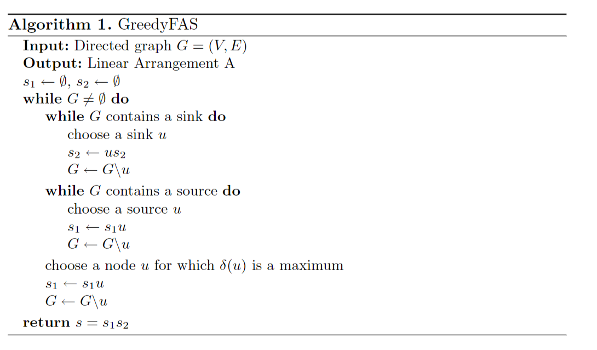
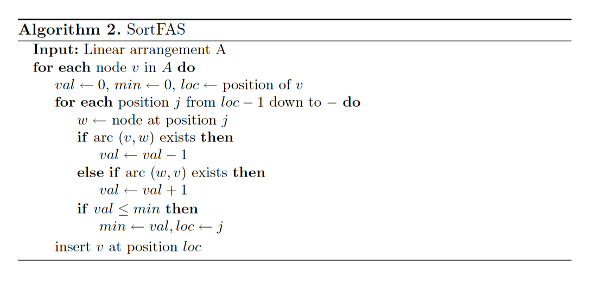
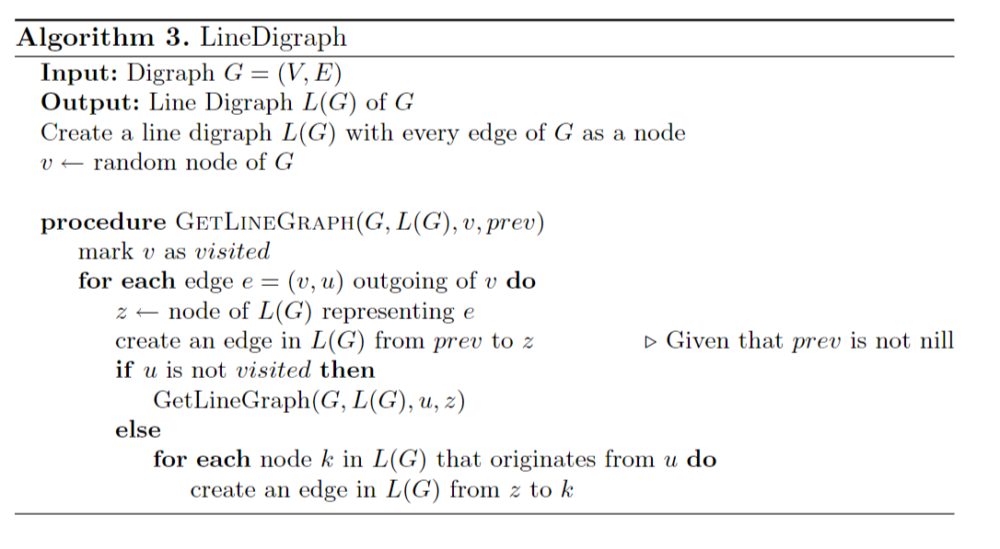
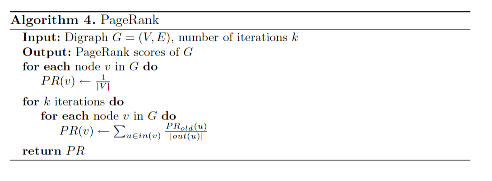
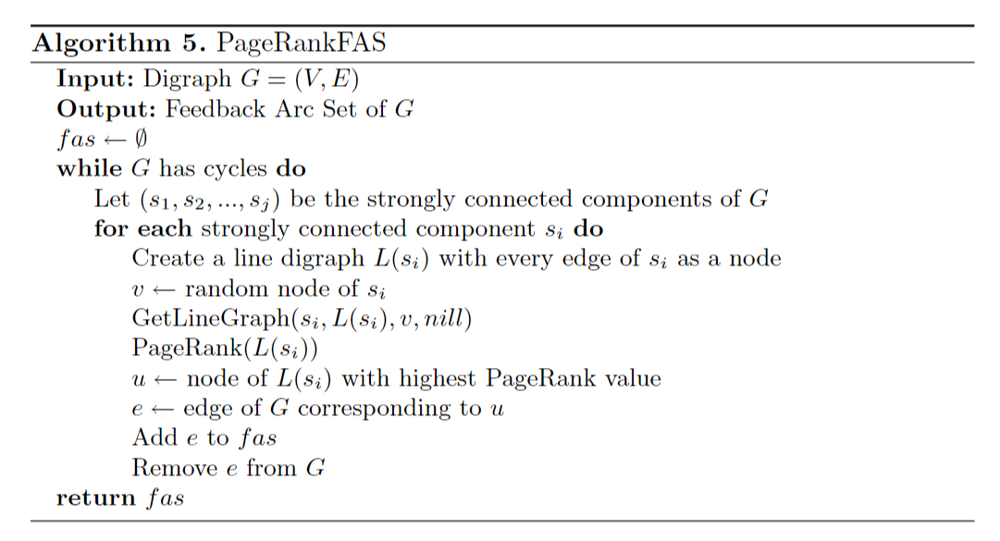
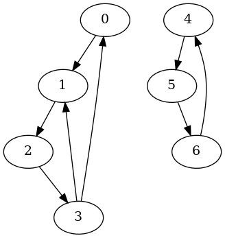
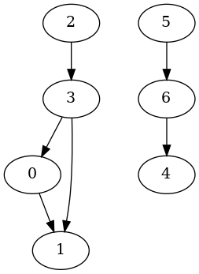

# Minimum Feedback Arc Set

[](https://www.boost.org/)


[](https://github.com/ktprime/emhash)

[English](README.md) | [简体中文](README-CN.md)

This project is an <b>unofficial</b> implementation based on the chained forward star graph storage, Boost (boost::hash, asio thread pool), and emhash7/8. It realizes three approximation algorithms for the Minimum Feedback Arc Set problem. The problem is to find the smallest set of arcs in a directed graph. The set of arcs is called a feedback arc set, which forms a cycle from the tail to the head of these arcs.

## Algorithm Implementations

The project implements three approximation algorithms based on the C++ language:

* GreedyFAS
This is a greedy algorithm that generates a linear ordering using a greedy approach and returns the set of backward edges in the resulting linear ordering.

- Greedy strategy
  - Find source nodes and append them to the end of the sequence s1, remove the node, and repeat until no source nodes are found
  - Find sink nodes and insert them at the beginning of the sequence s2, remove the node, and repeat until no sink nodes are found
  - If there are neither source nodes nor sink nodes, define the delta value (out-degree minus in-degree) and append the node with the maximum delta value to the end of s1.
  - Calculate the delta of the remaining nodes, and append the node with the maximum delta value to the end of s1 and remove it.
  - Return {s1,s2} -> minimum linear ordering



* SortFAS
This algorithm generates the initial minimum linear ordering problem (LA) based on the natural order of the indices and repeatedly adjusts the LA to minimize the number of backward edges.



* PageRankFAS
This algorithm is a heuristic algorithm from the paper [1] Geladaris V , Lionakis P , Tollis I G . Computing a Feedback Arc Set Using PageRank[J]. 2022, for computing the minimum feedback arc set (FAS) in a directed graph. The algorithm works as follows:

    Detect if the graph has cycles, if a cycle exists, do the following loop:

    1. Identify the strongly connected components si, i=0,1,... in the directed graph
    2. Traverse the strong component si, for each strong component si do the following:
       1. If the size of si is 1, skip the processing of this strongly connected component
       2. Choose a random node v in si and traverse to create the line graph L(si)
       3. Calculate PageRank of L(si)
       4. Select the node with the highest PageRank value in L(si), find the corresponding edge e in si, and add it to the minimum feedback arc set.
       5. Delete edge e in si
    3. If there are still cycles, repeat step 1 and 2 until there are no cycles in the graph.





The input of the PageRankFAS algorithm is a directed graph G, consisting of vertices V and edges E. The output is the feedback arc set of G.

This algorithm can be used to compute the minimum feedback arc set (FAS) in a directed graph, which is a challenging problem related to visualizing hierarchical structures. It performs better than existing heuristic methods and reduces FAS size by an average of over 50%. Although its execution time may increase for larger graphs due to the size of the generated polyline graph, it is still very fast even for large graphs used in graphical drawing applications with up to 4,000 nodes. Therefore, this method may be useful for researchers studying optimization tasks similar to computing FAS or involving directed graphs (such as ranking algorithms or network traffic analysis).

The implementation of this project is based on the C++ language, and the source code can be downloaded and compiled directly. Please refer to the README file in the project for detailed usage instructions.

## Running the Project
If you want to try these algorithms, you need to clone this project, install the Boost and gtest libraries, and then compile and run the project using cmake.

1. Open the terminal and enter the following command to update the package list:

   ```
   sudo apt-get update
   ```

2. Enter the following command to install the Boost and gtest libraries:

   ```
   sudo apt-get install libboost-all-dev libgtest-dev
   ```

3. Enter the following command to compile the project:

   ```
   cmake -B build && cmake --build build
   ```
   
4. Enter the following command to run the project:

   ```
   ./build/FASSolver [path/to/graph] [alorigthm (greedy | sort | pagerank)]
   ```

## Dataset

### Simple Graph

- graphs/simple.txt

   ```
   0,1
   1,2
   2,3
   3,0
   3,1
   4,5
   5,6
   6,4
   ```

### Large Graph

- graphs/wordassociation-2011.txt: 10,617 vertices and 72,172 directed edges
- graphs/enron.txt: 69,244 vertices and 276,143 directed edges

## Result

### Simple Graph

- graphs/simple.txt
  - PageRankFAS

   ```
   2
   1,2
   4,5
   ```




### Large Graph

- graphs/wordassociation-2011.txt
  - GreedyFAS: 13634 fas, time elapsed: 0.701s
  - SortFAS: 13510 fas, time elapsed: 0.817s
  - PageRankFAS: 12086 fas, time elapsed: 68.856s
- graphs/enron.txt
  - GreedyFAS: 38850 fas, time elapsed: 10.989s
  - SortFAS: 36548 fas, time elapsed: 14.281s
  - PageRankFAS: 33796 fas, time elapsed: 1398.224s

## Contributors

<a href="https://github.com/PKUcoldkeyboard/FAS/graphs/contributors">
  
</a>

Made with [contrib.rocks](https://contrib.rocks.).

## License
This project is licensed under the AGPL-3.0 License. See the LICENSE file for more information.

## References
[1] Geladaris V , Lionakis P , Tollis I G . Computing a Feedback Arc Set Using PageRank[J]. 2022.

