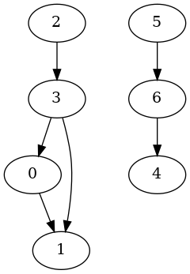

# Minimum Feedback Arc Set

[](https://www.boost.org/)


该项目是一个基于C++ Boost Graph Library(BGL)库的实现，实现了最小反馈弧集问题的三种近似算法。该问题是在有向图(DAG)中找到最小的反馈弧集，其中反馈弧集是指一组弧，使得从这些反馈弧的尾部到头部的路径构成一个环。

## 算法实现

该项目基于C++ BGL库实现了三种近似算法：

* GreedyFAS
这是一种基于贪心策略的算法，用贪心法生成一个线性排列，将该线性排列中的后向边集作为结果返回。

- 贪心策略
    - 查找源头点，若查到源头点则排到序列s1末尾并移除该点，重复直到没有源头点
    - 查找汇集点，若查到汇集点则排到序列s2头部并移除该店，重复直到没有汇集店
    - 若既没有源头点，也没有汇集点，则定义delta值（出度-入度），将delta最大的点排到s1末尾。
    - 计算剩余点的delta，将delta值最大的点排在s1末尾并移除该点。
    - 返回{s1,s2} -> 最小线性排列


* SortFAS
该算法根据序号的自然顺序生成初始最小线性排列问题（LA），不断调整LA使后向边的数量尽可能少。


* PageRankFAS
该算法是一种启发式算法，来自于论文[1] Geladaris V ,  Lionakis P ,  Tollis I G . Computing a Feedback Arc Set Using PageRank[J].  2022，用于计算有向图中的最小反馈弧集 (FAS)。该算法的工作原理如下：

    1. 检测图是否有环，如果存在环，执行以下循环：
      1. 识别有向图中的强连接分量si, i=0,1,...
      2. 遍历强连通分量si，对于每个强连通分量si，执行：
        1. 如果si的大小为1，跳过该强连通分量的处理
        2. 选择si中的一个随机节点v，从v开始遍历创建si的线图L(si)
        3. 计算L(si)的PageRank
        4. 选择L(si)中PageRank值最大的节点，找到si中对应的边e，添加到最小反馈弧集。
        5. 在si中删除边e
      3. 如果仍有环，重复执行1和2，直到图不存在环为止。


PageRankFAS 算法的输入是一个有向图 G，由顶点 V 和边 E 组成。输出是 G 的反馈弧集。

该算法可以用于可用于计算有向图中的最小反馈弧集（FAS），这是一个与可视化分层结构相关的具有挑战性的问题。它比现有的启发式方法更好，并将FAS大小平均减少了50％以上。尽管由于生成的折线图的大小，对于较大的网图，它的执行时间可能会增加，但即使对于在多达 4,000 个节点的图形绘制应用程序中使用的大型图形，它的运行速度也非常快。因此，这种方法对于研究需要计算 FAS 或涉及有向图（例如排名算法或网络流量分析等）的类似优化任务的研究人员可能很有用。

本项目的实现是基于C++语言，可以直接下载源代码并编译运行。详细的使用方法请参考项目中的 README 文件。

## 运行项目

如果您想尝试这些算法，需要克隆该项目，然后先安装Boost和gtest库，再使用cmake编译运行该项目

1. 打开终端并输入以下命令来更新软件包列表：

   ```
   sudo apt-get update
   ```

2. 输入以下命令来安装Boost库和gtest库：

   ```
   sudo apt-get install libboost-all-dev libgtest-dev
   ```

3. 输入以下命令编译项目

   ```
   cmake . && make
   ```

4. 输入以下命令运行项目

   ```
   ./FASSolver [path/to/graph] [alorigthm (greedy | sort | pagerank)]
   ```

## 数据集

1. 简单图

   每行表示一条边

   ```
   0 1
   1 2
   2 3
   3 0
   3 1
   4 5
   5 6
   6 4
   ```

2. 大型图: graphs/graph.txt

## 运行结果

1. 简单图: 最小反馈弧数量： 2



## 贡献者


## 许可证

This project is licensed under the AGPL-3.0 License. See the LICENSE file for more information.

## 参考文献

[1] Geladaris V ,  Lionakis P ,  Tollis I G . Computing a Feedback Arc Set Using PageRank[J].  2022.
